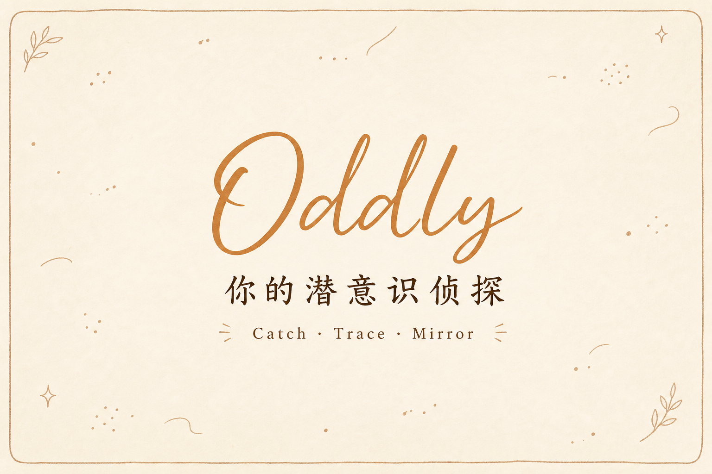
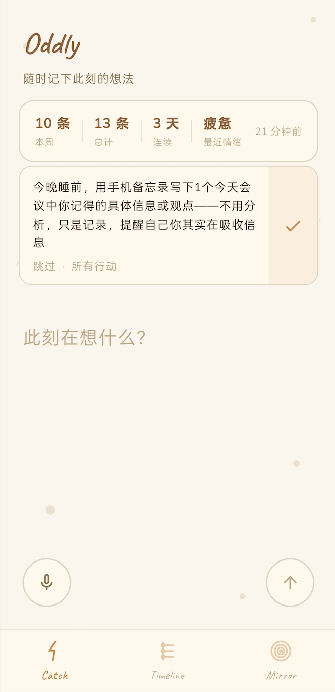
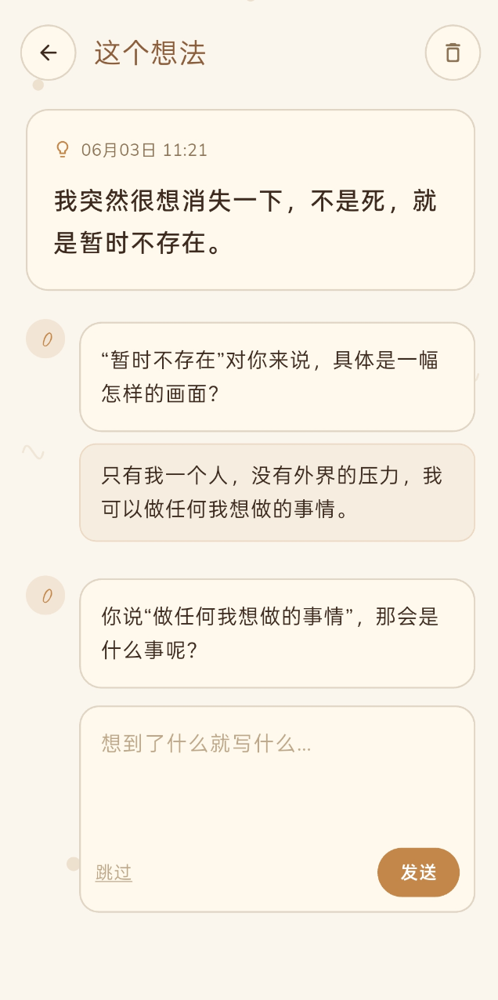
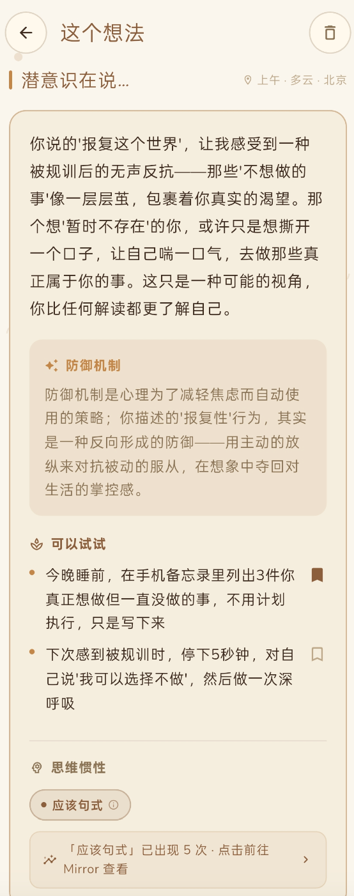
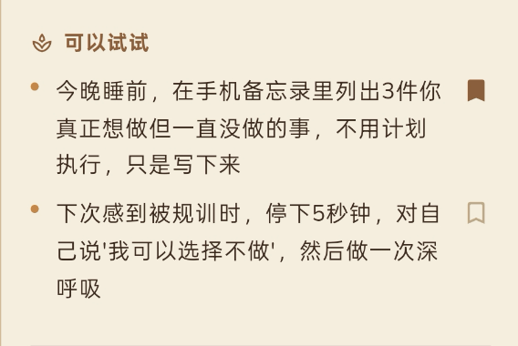
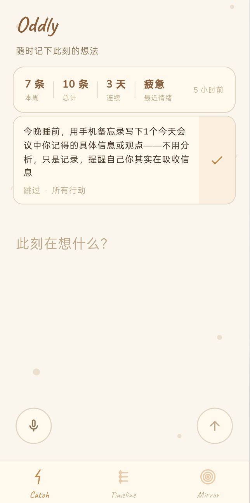
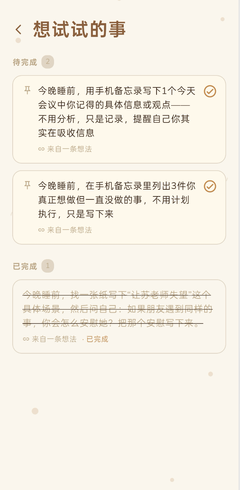
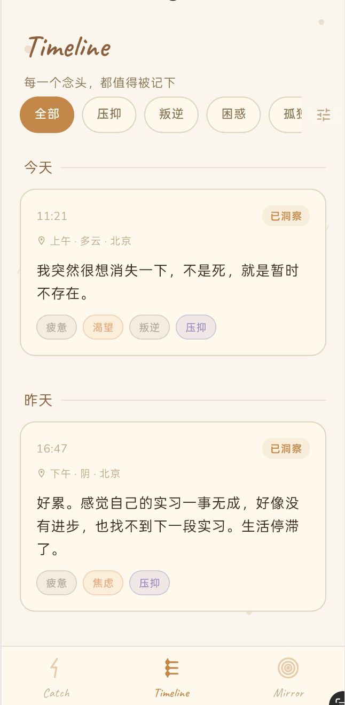
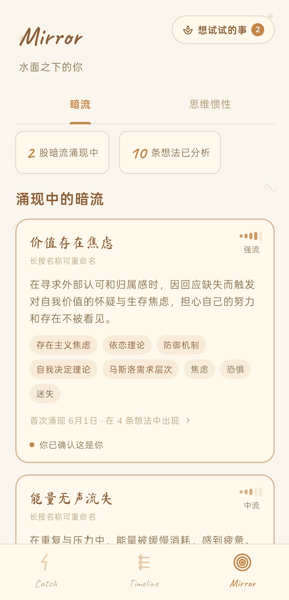
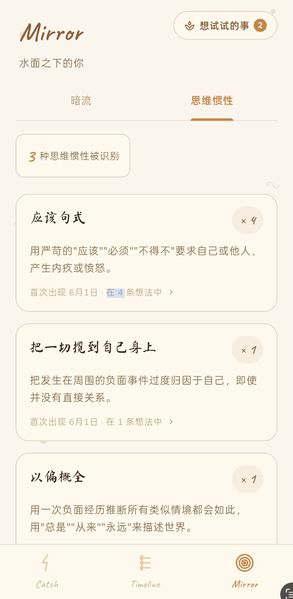

<p align="center">
  
</p>

<h1 align="center">Oddly · 你的潜意识侦探</h1>

<p align="center">
  <strong>接住那些一闪而过的想法，用 AI 引导反思，在本地安全地探索水面之下的自己</strong>
</p>

<p align="center">
  <a href="https://github.com/Eggnite-518/Oddly/releases"></a>
  
  
  
</p>

<p align="center">
  <a href="#-体验方式">体验方式</a> ·
  <a href="#-为什么是-oddly">产品亮点</a> ·
  <a href="#-应用截图">截图</a> ·
  <a href="#-快速开始">快速开始</a> ·
  <a href="#-发展路线图">路线图</a>
</p>

---

## 📥 体验方式

| 渠道 | 说明 |
|------|------|
| **[GitHub Releases](https://github.com/Eggnite-518/Oddly/releases)** | 下载最新 APK，推荐 |
| **自行编译** | 克隆仓库后本地构建，需自备 API Key（见下方快速开始） |

> 安装 APK 时，请在 Android 系统设置中允许「安装未知来源应用」。  
> AI 功能需配置 **DeepSeek API Key**；语音转写需 **阿里云 NLS** 凭证（可选）。

**⚠️ 友情提示：** Oddly 是个人作品集项目，功能仍在持续迭代中。如遇问题欢迎通过 [Issues](https://github.com/Eggnite-518/Oddly/issues) 反馈。

**📋 免责声明：** Oddly 是一款自我探索工具，AI 生成内容仅供参考，**不构成任何医疗或心理诊断**。

---

## 🌟 为什么是 Oddly？

Oddly 不是又一个 AI 日记，而是一条 **Catch → Trace → Mirror → Act** 闭环：

- 📝 **随时记录此刻** — 首页即输入框，文字 / 语音极速捕捉，降低门槛
- 🪞 **苏格拉底式追问** — AI 好奇地引导你往更深一层走（最多 3 轮），不急于给答案
- 🔍 **结构化洞察卡片** — 深层解读 + 心理学框架 + 可解释的思维惯性 + 行动建议，温暖且非诊断性
- 🌊 **看见长期模式** — 从多条记录中提炼「暗流」主题与认知模式统计
- ✅ **行动闭环** — 收藏建议进入行动清单，首页持续提醒，完成后洞察卡片同步更新
- 🔒 **本地优先** — 无自建后端，想法与对话默认仅存本机 SQLite

---

## ✨ 当前功能

| **📝 极速捕捉** | **🪞 AI 追问** | **🔍 洞察卡片** |
| :--- | :--- | :--- |
| 全屏输入 · 语音转文字 · 情境记录（时间 / 天气 / 位置） | 苏格拉底式引导提问 · AI 自决是否继续 · 最多 3 轮 | 深层解读 · 心理学框架 · 多视角切换 |
| **🧠 思维惯性** | **📅 时间轴** | **🌊 Mirror 模式识别** |
| 识别 8 类认知偏误 · 点击 tag 查看 AI 个性化解释 · 高频模式追踪 | 按时间回顾 · 横向滚动标签筛选 + 全标签 bottom sheet | 暗流（Currents）· 认知模式（Patterns）· 点击查看关联想法 |
| **✅ 行动闭环** | **🏷️ 情绪标签** | |
| 洞察卡片收藏行动建议 · 首页提醒卡片 · 完成 / 切换 · 清单长按删除 | AI 自动生成 · 支持手动修改 | |

<details>
<summary><strong>完整交互流程（点击展开）</strong></summary>

```
用户输入想法
    │
    ├─ [并行] 抓取时间 / 天气 / 位置
    │
    └─ 跳转详情页
         │
         ├─ AI 第 1 轮追问
         │    ├─ 用户回答 → 判断是否继续（最多 3 轮）
         │    └─ 用户跳过
         │
         └─ 生成洞察卡片 + 情绪标签
              ├─ 提取暗流（Mirror 层）
              ├─ 聚合认知模式统计
              └─ 行动建议可收藏 → 行动清单 → 首页提醒
```

Prompt 设计强调：**温暖、好奇、不评判、非诊断**。System Prompt 集中在 `oddly/lib/core/constants/prompts.dart`。

</details>

---

## 📸 应用截图

> 将截图放入 `docs/screenshots/` 目录，替换下方占位路径即可。

### 核心流程

| 捕捉 | AI 追问 | 洞察卡片 |
| :---: | :---: | :---: |
|  |  |  |
| *Catch 输入页* | *苏格拉底式对话* | *结构化洞察卡片* |

### 行动闭环

| 收藏行动建议 | 首页提醒 | 行动清单 |
| :---: | :---: | :---: |
|  |  |  |
| *洞察卡片一键收藏* | *首页卡片 · 完成 / 切换* | *行动清单管理* |

### 回顾与模式

| 时间轴 | 暗流 | 认知模式 |
| :---: | :---: | :---: |
|  |  |  |
| *Timeline 回顾* | *Mirror · 暗流* | *Mirror · 认知模式* |

<!-- 可选：演示视频 -->
<!-- [▶ 观看演示视频](https://your-video-link) -->

---

## 🛠️ 技术栈

| 领域 | 方案 |
|------|------|
| **框架** | Flutter 3 · Android 优先（minSdk 24+） |
| **状态管理** | Riverpod |
| **本地存储** | SQLite（sqflite），无自建后端 |
| **AI** | DeepSeek API（OpenAI 兼容接口），Prompt 分层设计 |
| **语音转写** | 阿里云 NLS |
| **情境数据** | Open-Meteo + 设备定位 |
| **UI** | 暖羊皮纸手绘风 · CustomPainter 自定义图标 |

---

## 🚀 快速开始

### 环境要求

- Flutter SDK ≥ 3.11（运行 `flutter doctor` 检查）
- Android Studio / Android SDK
- [DeepSeek API Key](https://platform.deepseek.com)（必填）
- 阿里云 NLS 凭证（可选，语音功能）

### 1. 克隆仓库

```bash
git clone https://github.com/Eggnite-518/Oddly.git
cd Oddly/oddly
```

### 2. 配置环境变量

在 `oddly/` 目录创建 `.env`（已在 `.gitignore` 中，不会提交）：

```env
DEEPSEEK_API_KEY=sk-your-deepseek-key

# 可选：语音转文字
ALI_KEY_ID=your-access-key-id
ALI_KEY_SECRET=your-access-key-secret
ALI_NLS_APP_KEY=your-nls-app-key
```

> ⚠️ 请勿将 `.env` 或真实 API Key 提交到 Git，也不要打包进公开发布的 APK。

### 3. 安装依赖并运行

```bash
flutter pub get
flutter run
```

### 4. 构建 Release APK

```bash
flutter build apk --release
```

产物：`oddly/build/app/outputs/flutter-apk/app-release.apk`  
可上传至 [GitHub Releases](https://github.com/Eggnite-518/Oddly/releases) 供他人下载。

---

## 🗺️ 发展路线图

| 已完成 ✅ | 规划中 💡 |
| :--- | :--- |
| 极速捕捉（文字 + 语音） | 思维星图可视化（Constella） |
| AI 苏格拉底式追问（最多 3 轮） | 周 / 月度潜意识洞察报告 |
| 洞察卡片 + 多视角切换 | Google Drive 云端备份 |
| 可解释的思维惯性标签 | Android 桌面小组件 |
| 行动建议收藏与行动闭环 | Embedding 语义自动关联 |
| 时间轴回顾 + 情绪标签筛选 | iOS 版本 |
| 暗流识别 + 认知模式统计 | |
| 情境记录（时间 / 天气 / 位置） | |

完整产品规划见 [`prd.md`](prd.md)。

---

## 🤝 如何贡献

欢迎 Issue、PR 与想法！大致流程：

1. **反馈问题或建议** — 通过 [GitHub Issues](https://github.com/Eggnite-518/Oddly/issues)
2. **贡献代码**
   - Fork 本仓库，创建分支 `feature/your-feature`
   - 提交更改 `git commit -m 'feat: 描述你的改动'`
   - 发起 Pull Request 到 `main`
3. **点个 Star** — 如果 Oddly 对你有启发，欢迎 Star ⭐ 支持

---

## 👤 关于作者

Oddly 是个人作品集项目，涵盖产品设计、Prompt 工程、Flutter 开发与 UI 实现。

- **GitHub：** [@Eggnite-518](https://github.com/Eggnite-518)
- **联系：** [在此补充邮箱 / 小红书 / 个人网站]

---

## 📄 许可证

本项目基于 [MIT License](LICENSE) 发布。

---

## 🙏 致谢

- [Flutter](https://flutter.dev/) — 跨平台 UI 框架
- [DeepSeek](https://www.deepseek.com/) — 大语言模型
- [阿里云 NLS](https://www.aliyun.com/product/nls) — 语音识别
- [Open-Meteo](https://open-meteo.com/) — 天气数据

---

<details>
<summary><strong>📂 项目结构（开发者向，点击展开）</strong></summary>

```
oddly/lib/
├── core/
│   ├── constants/prompts.dart   # AI System Prompt 与消息构建
│   └── theme/                   # 配色、装饰、主题
├── data/database/               # SQLite 模型与 CRUD
├── features/
│   ├── actions/                 # 行动建议清单
│   ├── capture/                 # 首页捕捉
│   ├── detail/                  # 详情 · 追问 · 洞察卡片
│   ├── timeline/                # 时间轴
│   └── mirror/                  # 暗流与认知模式
├── services/
│   ├── ai_service.dart          # DeepSeek 调用
│   ├── ali_asr_service.dart     # 语音转文字
│   ├── context_service.dart     # 情境抓取
│   ├── cognitive_pattern_service.dart
│   └── persona_service.dart     # 暗流提取与合并
└── main.dart
```

</details>

<details>
<summary><strong>🔒 隐私说明（点击展开）</strong></summary>

- **本地优先**：想法正文、对话历史、洞察卡片默认仅存储在本机
- **第三方 API**：AI 分析与语音转写会将相关内容发送至 DeepSeek / 阿里云
- **无账号体系**：当前版本无用户注册与云端同步

</details>
